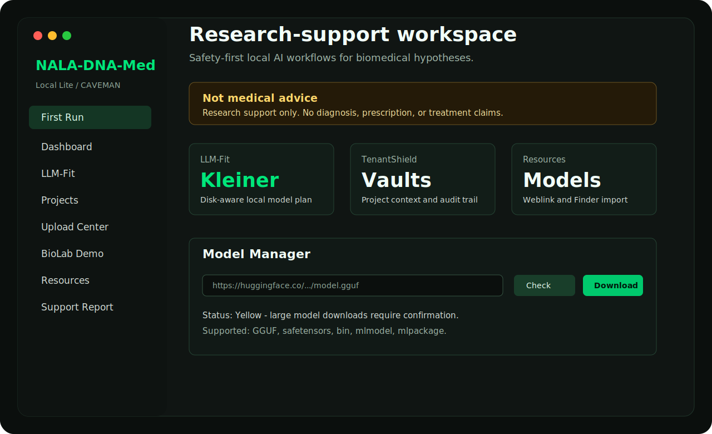
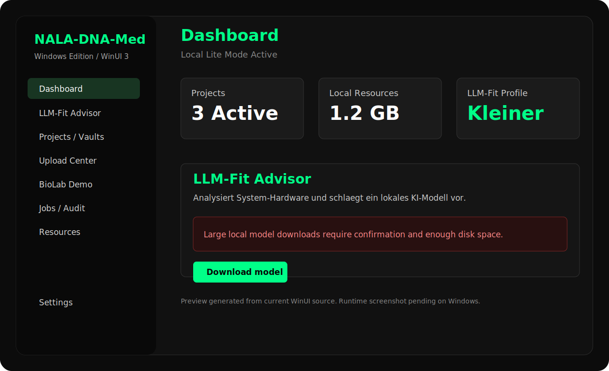

# NALA-DNA-Med

Native, local-first biomedical research-support software for macOS and Windows.

> **Critical boundary:** NALA-DNA-Med is not medical advice, not a medical device, and is not validated for diagnosis, treatment, prescription, or clinical decision-making.

## Mission

NALA-DNA-Med exists to give researchers, doctors, patient advocates, builders, and technically curious domain experts a transparent starting point for biomedical hypothesis work. The project is motivated by a simple frustration: many treatments reduce symptoms while still creating heavy side-effect burdens, long-term dependency, or quality-of-life tradeoffs.

This software does not claim to solve that problem by itself. Its goal is to provide a practical open foundation where people can organize evidence, explore molecular and biological hypotheses, inspect risks, compare ideas, and build local AI-assisted workflows without handing sensitive research data to a cloud service by default.

The media-facing version is simple: NALA-DNA-Med is an open research-support tool for turning scattered biomedical ideas and sources into structured, testable hypotheses. The long-term hope is to help teams find more precise therapeutic directions for specific diseases, understand disease mechanisms in context, and prioritize interventions that could be validated by real science.

## Kurzfassung

NALA-DNA-Med soll ein offener Grundstein fuer lokale biomedizinische Forschung werden: nicht als Heilversprechen, sondern als Werkzeug, um Ideen, Quellen, Molekuel-/Protein-Daten, Nebenwirkungsfragen und regenerative Forschungsansaetze sauberer zusammenzubringen.

## Structure

- `macOS/`: Native SwiftUI macOS app with CAVEMAN install path, LLM-Fit, model import, safety boundary, docs, and DMG workflow.
- `Windows/`: Native WinUI 3 / Windows App SDK client created with the same product direction and LLM-Fit concept.
- `-NALA-DNA-MED-fundamentdateien-/`: Original concept packages, pitch material, screenshots, source/data bundle, and early app mockups.
- `docs/`: Cross-platform project vision, source archive notes, safety framing, and public-facing project story.

## Current UI Preview

| macOS SwiftUI | Windows WinUI |
|---|---|
|  |  |

Additional foundation screenshots are preserved in `-NALA-DNA-MED-fundamentdateien-/pre Screenshots/`.

## Core Ideas

- **Local-first:** sensitive biomedical project work should run locally by default.
- **CAVEMAN install:** non-technical users must be able to install and start without Terminal, Docker, Git, or developer knowledge.
- **LLM-Fit:** the app recommends smaller, optimal, or maximal local model setups based on the actual computer and free disk space.
- **TenantShield:** project and tenant context should prevent accidental data mixing.
- **Explicit safety boundary:** research support only; no diagnosis or treatment claims.
- **Open foundation:** the repository should expose the idea, sources, and implementation direction so other people can build on it.

## Current Apps

### macOS

The macOS app is a SwiftUI package in `macOS/`.

```bash
cd macOS
swift test
swift build
./script/build_and_run.sh --verify
./script/make_dmg.sh
```

The generated DMG is `macOS/dist/NALA-DNA-Med.dmg`.

### Windows

The Windows app is in `Windows/` and uses WinUI 3 / Windows App SDK.

The Windows version is intentionally kept in this repository. Do not remove or overwrite it when working on macOS docs or packaging.

## Fundamentals

The original project foundation is preserved in `-NALA-DNA-MED-fundamentdateien-/`:

- `pre App Idee's/`: idea archives
- `pre App Pitch/`: pitch deck, source/data PDF, and source package
- `pre Screenshots/`: early UI screenshots
- repository link artifact

Start with [docs/PROJECT_VISION.md](docs/PROJECT_VISION.md), [docs/WIKI_INDEX.md](docs/WIKI_INDEX.md), and [-NALA-DNA-MED-fundamentdateien-/README.md](-NALA-DNA-MED-fundamentdateien-/README.md).

## Next-Version Ideas

The roadmap is tracked in [docs/ROADMAP.md](docs/ROADMAP.md). Planned research directions include:

- an `autoresearch`-inspired loop for bounded software/retrieval experiments, with metrics and human review
- a MemPalace-style local memory layer for project notes, sources, decisions, and recall
- an LLM-maintained markdown wiki with immutable raw sources and auditable public/private summaries
- an Ubuntu server edition with multi-user data vaults and light clients for macOS, Windows, iOS, Android, and web
- a public wiki for non-sensitive methods, student exercises, and reusable research notes
- restricted vault workflows with pseudonymization, consent, access logs, and doctor-notification concepts for clinically governed deployments

See [docs/REFERENCES.md](docs/REFERENCES.md) for source links and [docs/SERVER_MULTIUSER_PLAN.md](docs/SERVER_MULTIUSER_PLAN.md) for the server concept.

## License, Governance, and Responsible Use

The project is intended to remain open and useful for students, schools, doctors, researchers, and public-interest builders. A final legal setup still needs specialist review because two goals must be reconciled carefully:

- open-source access for public benefit
- a future foundation or fund model for commercial profit-sharing, grants, student workspaces, and global-health research support

See [docs/LEGAL_AND_GOVERNANCE_DRAFT.md](docs/LEGAL_AND_GOVERNANCE_DRAFT.md), [docs/FOUNDATION_CONCEPT.md](docs/FOUNDATION_CONCEPT.md), and [docs/RESPONSIBLE_USE_POLICY.md](docs/RESPONSIBLE_USE_POLICY.md). These are project drafts, not legal advice.

## Public Position

This project is allowed to be ambitious, but it must remain honest:

- It can help organize and explore biomedical research hypotheses.
- It can help compare sources, mechanisms, risks, and possible research directions.
- It can help programmers and domain experts collaborate.
- It cannot claim to cure cancer, autoimmune disease, eye disease, organ damage, or any other condition.
- Any real therapeutic discovery requires laboratory validation, clinical trials, regulatory review, and medical responsibility.
