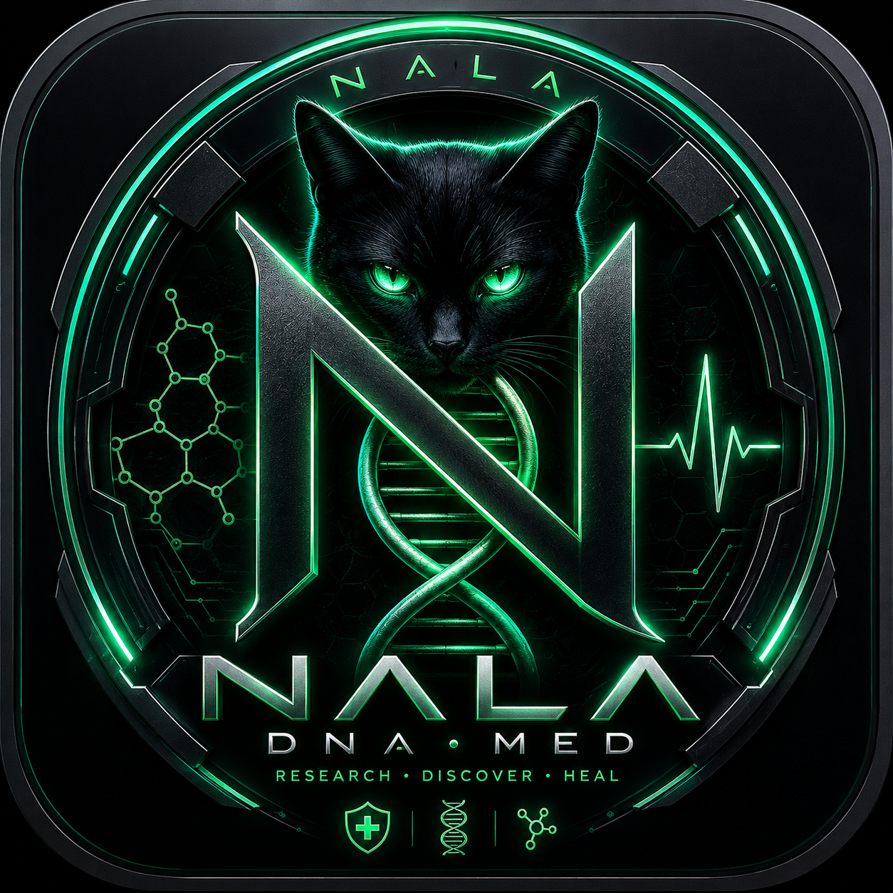

# NALA-DNA-Med macOS

<p align="center">
  
</p>

Native SwiftUI macOS app for local-first biomedical research-support workflows.

---

### 📥 Download Pre-Compiled macOS App / Fertige macOS App Herunterladen

> [!IMPORTANT]
> **No compilation required!** You do not need to build the Swift code manually. Simply download the pre-compiled `.dmg` file directly from the **[GitHub Releases](https://github.com/Master-MD/NALA-DNA-Med/releases)** page, open it, and drag the app into your `/Applications` folder!
>
> **Keine manuelle Kompilierung notwendig!** Sie müssen das Swift-Projekt nicht selbst bauen. Laden Sie einfach das fertige `.dmg`-Paket direkt von der **[GitHub Releases](https://github.com/Master-MD/NALA-DNA-Med/releases)**-Seite herunter, öffnen Sie es und ziehen Sie die App direkt in Ihren `/Applications`-Ordner!

---

> NALA-DNA-Med is not medical advice, not a medical device, and not validated for diagnosis, treatment, prescription, or clinical decision-making.

## What Is Included

- SwiftUI macOS app scaffold.
- CAVEMAN first-run path.
- System Check and LLM-Fit recommendation.
- Resources > Model Manager with Weblink download and Finder/external-drive model import.
- BioLab dry-run demo with safety flags.
- Local audit/support-report surfaces.
- App icon and DMG packaging script.
- README, FAQ, install docs, safety docs, and Windows strategy notes.

## Build and Test

```bash
swift test
swift build
./script/build_and_run.sh --verify
./script/make_dmg.sh
```

Generated artifacts:

- `dist/NALA-DNA-Med.app`
- `dist/NALA-DNA-Med.dmg`

## Model Manager

The app can add models without Terminal:

- Weblink: paste a trusted `https://` or `http://` model URL, check it, then download it.
- Finder/external drive: choose a `.gguf`, `.safetensors`, `.bin`, `.mlmodel`, or `.mlpackage` and import it.

Imported and downloaded model files are stored under `~/Library/Application Support/NALA-DNA-Med/Models`.

## Local Ollama State on the Build Machine

Prepared on 2026-05-27:

- `qwen3:4b`
- `qwen3-embedding:0.6b`

Already present before this run:

- `hf.co/Jiunsong/supergemma4-26b-uncensored-gguf-v2:latest`

The DMG does not embed these multi-GB model weights.
